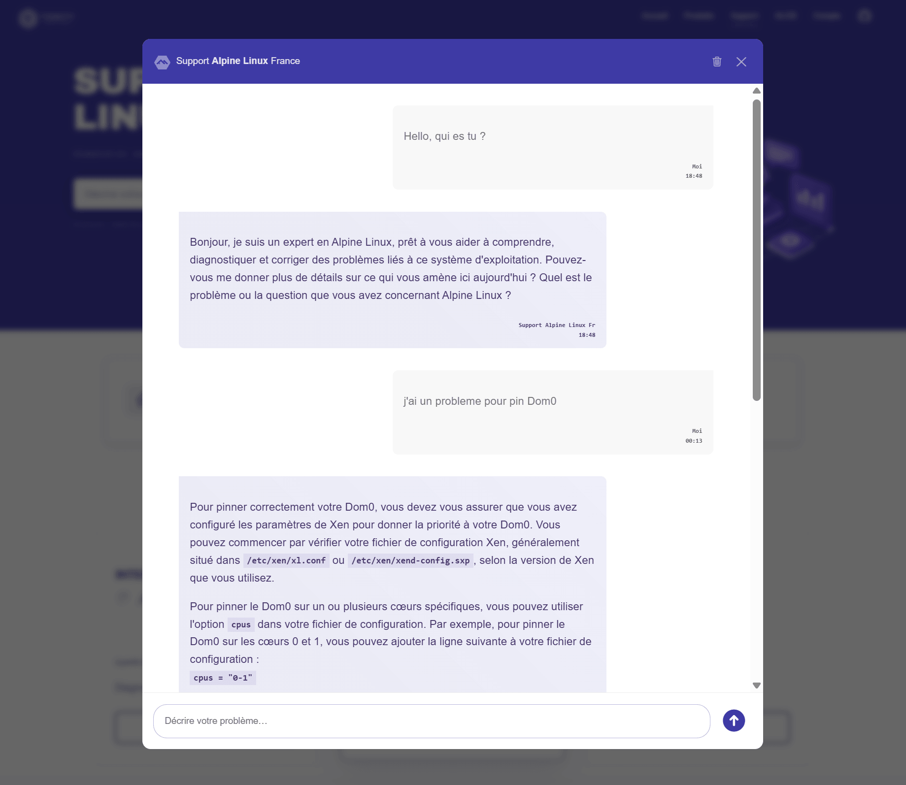
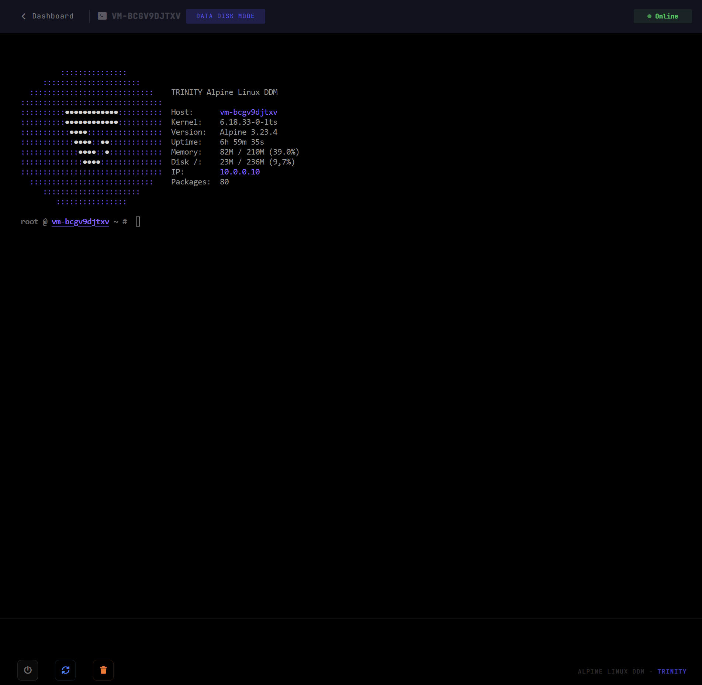
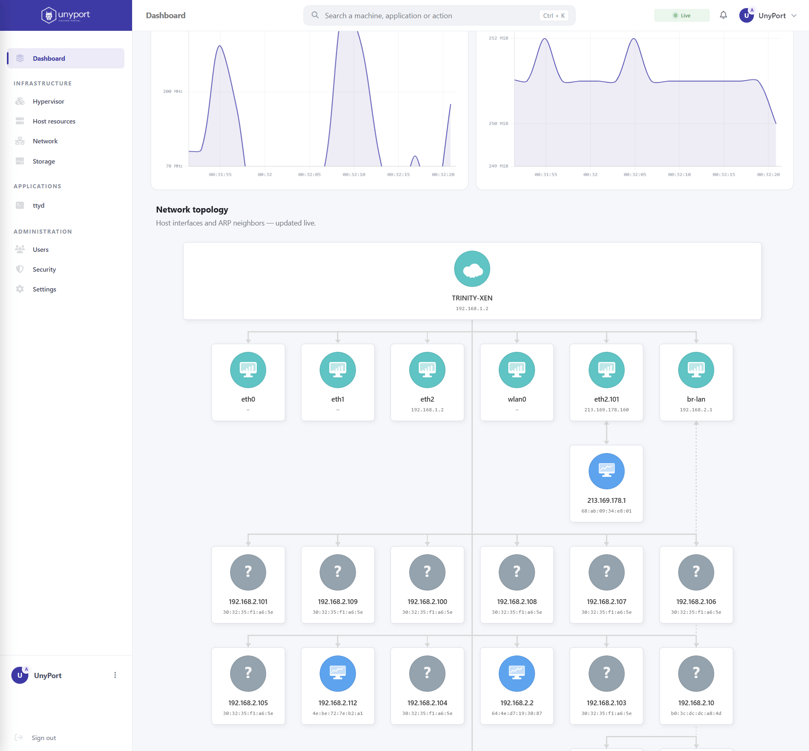

<div align="right">


</div>

<br><br>

<div align="center">
<div align="center">


</div>


<br>

</div>

# 🟪 TRINITY Edge Network

**Sovereign Infrastructure Stack**

*Edge · Embedded · AI Sandbox · Defense*

---

<br>

⬛ **The Problem**

Modern infrastructure stacks are **unauditable by design**.

Systemd. Glibc. Hundreds of background services.
Mutable state that drifts over time.
Attack surface that no single engineer can fully map.

**This is not a configuration problem. It is an architectural one.**

---

<br>

⬛ **The Stack**

TRINITY is a sovereign infrastructure stack built on three non-negotiable principles :

**Minimal surface** — Only what is strictly necessary runs.
No systemd. No glibc. No unnecessary daemon.
Every component is justifiable.

**Deterministic state** — The system runs entirely in RAM.
Configuration is controlled via LBU commit.
At reset, the system returns to its exact defined state.
Not approximately. Exactly.

**Hardware-level isolation** — Xen Type-1 hypervisor.
Isolation is enforced at the hardware boundary, not the kernel boundary.
A compromised guest cannot reach the host. By design, not by configuration.

---

<br>

⬛ **Architecture**

<br>

<div align="center">
 &nbsp;&nbsp;&nbsp;&nbsp;&nbsp;&nbsp;&nbsp;&nbsp;&nbsp;&nbsp;&nbsp;&nbsp;&nbsp;&nbsp;&nbsp;&nbsp;&nbsp;&nbsp;&nbsp;&nbsp;&nbsp;&nbsp;&nbsp;&nbsp;&nbsp;&nbsp;&nbsp;&nbsp;&nbsp;&nbsp; 

<br><br>

| Layer | Component | Role |
|---|---|---|
| **Dom0 — Control** | Alpine Linux | Host OS — musl · busybox · OpenRC · No systemd |
| | Xen Type-1 | Hardware hypervisor — hardware-level isolation |
| | UnyPort | Single Go binary · single port · control plane |
| **DomU — Workloads** | Isolated VM | One VM per service · independent lifecycle |
| | Data Disk Mode | Full system in RAM · LBU commit · deterministic state |
| | Reset engine | < 2s reset · exact state restoration · by design |
| **Network** | kernel firewall | Stateful filtering · NAT · zero implicit flow |
| | VLAN / GPON | Full segmentation · ISP independence |

</div>

---

<br>

⬛ **Positioning**

<div align="center">

| | TRINITY | RHEL | Proxmox |
|---|:---:|:---:|:---:|
| **Base system** | musl · busybox | glibc · systemd | Debian · systemd |
| **Runtime state** | RAM · deterministic | Mutable | Mutable |
| **Reset** | < 2s · guaranteed | Manual | Snapshot |
| **Attack surface** | Minimal by construction | 400+ default services | 300+ default services |
| **US dependency** | None | IBM · Red Hat | None |
| **Edge / Embedded** | Native | Not designed for | Not designed for |
| **Auditability** | Full | Partial | Partial |
| **License cost** | Open core | $349–$1500/server/year | AGPL + Enterprise |

</div>

---

<br>

⬛ **Use Cases**

<br>



<br><br>

⬛ **AI Agent Sandbox**
Ephemeral isolated execution environments for LLM agents and code generation pipelines.
Hardware-level isolation. Deterministic reset between sessions.
No state contamination. No escape path.

⬛ **CTF & Cybersecurity Infrastructure**
Per-team isolation at hypervisor level.
Instant environment reset between rounds.
Minimal attack surface — no false positives from background services.

⬛ **Edge & Embedded Systems**
Single binary deployment. Zero runtime dependency.
Runs on 9W TDP hardware. Full system in RAM.
Deterministic behavior on power cycle — critical for drone and embedded contexts.

⬛ **Sovereign Infrastructure**
Zero dependency on US commercial software stacks.
Fully auditable from kernel to application layer.
Reproducible by construction — same LBU archive, same system, always.

---

<br>

⬛ **Proof**

```
This bastion has been publicly exposed since Q1 2026.
Intrusion attempts   73 679
Successful breaches       0
Active sessions           6
```

No firewall magic. No hidden service.
**Minimal surface. Maximum control.**

→ [Audit the infrastructure](https://trinity-net.com)



<br><br>

---

<br>

⬛ **Official Dashboard**

**[UnyPort](https://codeberg.org/tony-bonnin/unyport)**
Official GuI for TRINITY
Unified sysadmin portal in Go — Xen-aware, single binary, single port.
Real-time metrics · VM lifecycle · Security status · OAuth GitHub/GitLab.
Live → [demo.unyport.app](https://demo.unyport.app)

<br>



<br><br>


⬛ **Documentation**

→ [Alpine Linux White Book for TRINITY Edge Networks — 03/2026](https://trinity-net.com/docs/alpine-linux-white-book.pdf)

*22-page technical reference covering architecture principles,
Data Disk Mode, Xen segmentation, network design and sovereign infrastructure patterns.*

---

<br><br>

⬛ **Contact**

For enterprise inquiries, integration licensing or infrastructure audit :

<div align="center">

<br>

🌐 [trinity-net.com](https://trinity-net.com)
📩 [support@trinity-net.com](mailto:support@trinity-net.com)
🦣 [@trinity@defcon.social](https://defcon.social/@trinity)
🦊 [gitlab.alpinelinux.org/trinity-labs](https://gitlab.alpinelinux.org/trinity-labs)

<br>

*Contributor @ Alpine Linux · Est. 2020 · Versailles, France*

**A system you understand is a system you control.**

</div>